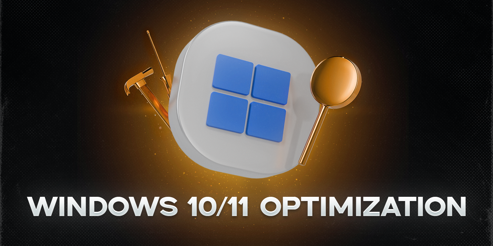

# Полное руководство по оптимизации Windows 10 и Windows 11

Это комплексное руководство предназначено для тонкой настройки и оптимизации Windows 10 и Windows 11 с целью повышения производительности, отзывчивости системы и отключения ненужных функций. Все шаги разделены на логические блоки и снабжены подробными объяснениями.

> **⚠️ Внимание!**
> Перед началом рекомендуется создать точку восстановления системы.
> Выполняйте действия внимательно, следуя инструкциям. Автор не несет ответственности за возможные сбои.



---

## 📋 Содержание

### Windows 10
1. [Очистка диска (Windows 10)](#очистка-диска-windows-10)
2. [Оптимизация электропитания и сети (Windows 10)](#оптимизация-электропитания-и-сети-windows-10)
3. [Настройка системных параметров (Windows 10)](#настройка-системных-параметров-windows-10)
4. [Конфиденциальность и безопасность (Windows 10)](#конфиденциальность-и-безопасность-windows-10)
5. [Управление программами и автозагрузкой (Windows 10)](#управление-программами-и-автозагрузкой-windows-10)
6. [Настройка периферии (Windows 10)](#настройка-периферии-windows-10)
7. [Отключение ненужных служб (Windows 10)](#отключение-ненужных-служб-windows-10)
8. [Дополнительные настройки (Windows 10)](#дополнительные-настройки-windows-10)

### Windows 11
9. [Подготовка системы (Windows 11)](#подготовка-системы-windows-11)
10. [Очистка диска (Windows 11)](#очистка-диска-windows-11)
11. [Оптимизация электропитания и сети (Windows 11)](#оптимизация-электропитания-и-сети-windows-11)
12. [Настройка системных параметров (Windows 11)](#настройка-системных-параметров-windows-11)
13. [Персонализация и интерфейс (Windows 11)](#персонализация-и-интерфейс-windows-11)
14. [Конфиденциальность и защита (Windows 11)](#конфиденциальность-и-защита-windows-11)
15. [Управление программами (Windows 11)](#управление-программами-windows-11)
16. [Отключение ненужных служб (Windows 11)](#отключение-ненужных-служб-windows-11)
17. [Дополнительные настройки (Windows 11)](#дополнительные-настройки-windows-11)

---

## Windows 10

### Очистка диска (Windows 10)

#### 1. Удаление временных файлов
Нажмите `Win + R` и введите по очереди следующие команды. В открывшихся окнах удалите ВСЁ содержимое этих папок (выделите всё `Ctrl+A` и удалите `Delete`).

* `%temp%`
* `temp`
* `prefetch`

> **Примечание:** Система может запретить удаление некоторых файлов — это нормально, просто пропустите их.

#### 2. Очистка кэша обновлений Windows
Нажмите `Win + R`, введите:
* `%windir%\SoftwareDistribution\Download`
Удалите всё содержимое этой папки.

#### 3. Очистка кэша драйверов NVIDIA (если у вас видеокарта NVIDIA)
Нажмите `Win + R` и введите по очереди пути:
* `%ProgramData%\NVIDIA Corporation\Downloader`
* `%ProgramFiles%\NVIDIA Corporation\Installer2`
Удалите содержимое этих папок.

#### 4. Удаление OneDrive (по желанию)
Если вы не пользуетесь OneDrive, его можно полностью удалить.

1. Откройте командную строку (Запустите от имени администратора: нажмите `Win+X` и выберите "Командная строка (администратор)" или "Windows PowerShell (администратор)").
2. Скопируйте и выполните команды по очереди:
    ```cmd
    taskkill /f /im OneDrive.exe
    %SystemRoot%\SysWOW64\OneDriveSetup.exe /uninstall
    ```

### Оптимизация электропитания и сети (Windows 10)

#### 1. Настройка сетевого адаптера
1. Нажмите `Win + R`, введите `devmgmt.msc` и нажмите Enter (откроется Диспетчер устройств).
2. Раскройте "Сетевые адаптеры", кликните правой кнопкой мыши на ваш сетевой адаптер и выберите "Свойства".
3. Перейдите во вкладку "Дополнительно". Найдите и установите в значение **Disabled** (Отключено) следующие пункты (не все могут присутствовать):
    * `Energy Efficient Ethernet (EEE)`
    * `Advanced EEE`
    * `Gigabit Lite`
    * `Green Ethernet`
    * `Power Saving Mode`
    * `Selective Suspend`
4. Перейдите во вкладку "Управление электропитанием" и **снимите все галочки**.

#### 2. Оптимизация сетевого стека TCP/IP
1. Запустите командную строку **от имени администратора**.
2. Выполните следующие команды по очереди:
    ```cmd
    netsh int tcp set global autotuninglevel=disabled
    netsh int tcp set supplemental template=internet congestionprovider=ctcp
    ```
    Эти команды отключают автоматическую настройку TCP и устанавливают более агрессивный алгоритм для лучшей скорости загрузки.

#### 3. Повышение пропускной способности сети
1. Нажмите `Win + R`, введите `gpedit.msc` и нажмите Enter (откроется Редактор локальной групповой политики).
2. Перейдите по пути: `Конфигурация компьютера -> Административные шаблоны -> Сеть -> Планировщик пакетов QoS`.
3. Найдите политику "Ограничить резервируемую пропускную способность", дважды щелкните по ней, установите "Включено" и в поле "Ограничение пропускной способности" укажите **0**.

### Настройка системных параметров (Windows 10)

Большинство настроек находятся в приложении "Параметры Windows" (`Win + I`).

#### Система
* **Уведомления и действия:** "Редактировать быстрые действия" — отключите всё лишнее.
* **Фокусировка внимания:** Отключите все автоматические правила и снимите галочку "Показывать сводку на временной шкале...".
* **Дисплей:**
    * Установите "Масштаб и разметка" на **100%**.
    * "Графика" -> "Изменить параметры графики" -> Включите "**Планирование графического процессора с аппаратным ускорением**" (если вы не стример).
    * "Дополнительные параметры дисплея" -> Выберите максимальную доступную частоту обновления (Гц).
* **Память:** Отключите "**Контроль памяти**".
* **Планшет:** Установите "При входе в систему" в значение "**Использовать режим рабочего стола**". Снимите галочку "Запрашивать разрешение...". В "Дополнительных параметрах" отключите все тумблеры.
* **Многозадачность:** В разделе "Временная шкала" отключите "**Показывать предложения на временной шкале**".

#### Специальные возможности
* **Указатель мыши:** Отключите "**Показывать след указателя мыши**".
* **Экранная лупа:** Отключите и снимите все галочки.
* **Экранный диктор:** Отключите и снимите все галочки.
* **Клавиатура:** Отключите "Залипание клавиш", "Фильтрацию ввода" и все связанные с ними уведомления.

#### Игры
* **Меню игровой панели:** Отключите "**Записывать клипы и создавать снимки экрана с помощью игровой панели**".
* **Игровой режим:** Включите "**Игровой режим**".

#### Обновление и безопасность
* **Оптимизация доставки:** "Дополнительные параметры" -> Отключите "**Разрешить загрузку с других компьютеров**".

### Конфиденциальность и безопасность (Windows 10)

Перейдите в `Параметры -> Конфиденциальность`.

* **Общие:** Отключите **все** пункты.
* **Речь, рукописный ввод и ввод текста:** Отключите голосовые функции и персонализацию рукописного ввода.
* **Диагностика и отзывы:**
    * Выберите "**Основной**" режим телеметрии.
    * Отключите "**Настраиваемые данные об опыте**" и "**Отправлять данные о моих привычках...**".
* **Журнал действий:** Отключите "**Хранить журнал моих действий на этом устройстве**".
* **Расположение:**
    * Отключите службу расположения.
    * Нажмите "**Очистить**" в разделе "История расположений".
* **Фон приложений:** Прокрутите список и **отключите** фоновую работу для всех ненужных приложений.
* **Разрешения приложений:** Всё, что ниже "Фоновых приложений" (например, Камера, Микрофон, Уведомления), рекомендуется **проверить и отключить** для приложений, которым не нужно соответствующее разрешение.

### Управление программами и автозагрузкой (Windows 10)

#### 1. Управление автозагрузкой
Нажмите `Ctrl + Shift + Esc` -> Перейдите на вкладку "Автозагрузка". Кликните правой кнопкой мыши по ненужным программам и выберите "Отключить".

#### 2. Удаление программ
Нажмите `Win + R`, введите `appwiz.cpl` -> Удалите программы, которыми не пользуетесь.

#### 3. Отключение фоновых приложений
`Параметры -> Приложения -> Приложения в фоновом режиме` -> Установите переключатель "Разрешить приложениям работать в фоновом режиме" в положение **Выкл.** или выборочно отключите ненужные приложения.

### Настройка периферии (Windows 10)

#### Мышь
1. `Параметры -> Устройства -> Мышь -> Дополнительные параметры мыши`.
2. Во вкладке "Параметры указателя" — **снимите галочку** "**Включить повышенную точность установки указателя**".
3. Во вкладке "Кнопки мыши" — установите ползунок "Скорость выполнения двойного щелчка" на **максимум**.

#### Клавиатура
`Параметры -> Специальные возможности -> Клавиатура` -> Отключите все опции: "Залипание клавиш", "Фильтрация ввода", "Озвучивание переключения".

### Отключение ненужных служб (Windows 10)

1. Нажмите `Win + R`, введите `services.msc`.
2. Для каждой службы из списка ниже найдите её, дважды щелкните, установите "Тип запуска: **Отключена**", нажмите "Остановить" и "Применить".

**Список служб для отключения (с пояснениями):**

* **Службы Hyper-V (если вы не используете виртуальные машины):**
    * Служба узла HV
    * Служба Hyper-V PowerShell Direct
    * Служба пульса (Hyper-V)
    * Служба виртуализации удалённых рабочих столов Hyper-V
    * Служба синхронизации времени Hyper-V
    * Служба завершения работы в качестве гостя (Hyper-V)
    * Служба обмена данными (Hyper-V)
    * Служба сеанса виртуальных машин Hyper-V

* **Службы датчиков (если нет датчика отпечатков или освещённости):**
    * Служба датчиков
    * Служба данных датчиков
    * Служба наблюдения за датчиками

* **Прочие службы:**
    * Биометрическая служба Windows
    * Сетевая служба Xbox Live
    * Функциональные возможности для подключённых пользователей и телеметрия
    * Windows Mixed Reality OpenXR Service (если нет VR-гарнитуры)
    * Xbox Accessory Management Service (если нет аксессуаров Xbox)
    * Диспетчер платежей и NFC (если не используете NFC)
    * Модуль поддержки NetBIOS через TCP/IP (для домашних сетей)
    * Политика удаления смарт-карт (если не используете смарт-карты)
    * Служба демонстрации магазина
    * Телефония / Телефонная связь
    * Служба шифрования дисков BitLocker (если не используете BitLocker)
    * Установщик ActiveX (AxInstSV)
    * Служба сенсорной клавиатуры и панели рукописного ввода (если нет сенсорного экрана)

### Дополнительные настройки (Windows 10)

#### 1. Настройка Проводника
1. Откройте любую папку. Нажмите "Файл" -> "Изменить параметры папок и поиска".
2. Во вкладке "Общее":
    * Установите "Открыть проводник для:" в значение "**Этот компьютер**".
    * Снимите галочки "Показывать недавно использовавшиеся файлы..." и "Показывать часто используемые папки...".

#### 2. Отключение удалённого доступа
1. Нажмите `Win + Pause/Break` (откроется "Свойства системы").
2. Слева выберите "Дополнительные параметры системы".
3. Во вкладке "Удалённый доступ" выберите "**Не разрешать подключения к этому компьютеру**".

#### 3. Настройка специальных возможностей (Панель управления)
1. Откройте Панель управления -> Центр специальных возможностей.
2. По очереди зайдите в каждый пункт и снимите все галочки, особенно:
    * **Оптимизация изображения на экране** (снять все).
    * **Упрощение работы с мышью** -> "Настройка управления указателем" (снять все галочки).
    * **Облегчение работы с клавиатурой** -> "Настройка залипания клавиш", "Настройка фильтрации ввода" (снять все галочки).

#### 4. Отключение индексирования (для SSD не критично, но уменьшает фоновую активность)
1. Откройте "Этот компьютер", кликните правой кнопкой по системному диску (C:) -> "Свойства".
2. Внизу снимите галочку "**Разрешить индексировать содержимое файлов на этом диске в дополнение к свойствам файла**". Примените изменения ко всем вложенным папкам и файлам.

---

## Windows 11

### Подготовка системы (Windows 11)

> **ℹ️ Примечание:**  
> Данный раздел предназначен для оптимизации Windows 11 после переустановки системы. Рекомендуется выполнять настройки по порядку.

#### 1. Обновление системы
* Перейдите в `Параметры → Центр обновления Windows`
* Нажмите "Проверить наличие обновений"
* Установите все доступные обновления
* **Перезагрузите компьютер** после установки

### Очистка диска (Windows 11)

#### 1. Удаление временных файлов
Нажмите `Win + R` и введите по очереди следующие команды. В открывшихся окнах удалите содержимое этих папок:

* `%temp%`
* `temp`
* `prefetch`

#### 2. Очистка кэша обновлений Windows
Нажмите `Win + R`, введите:
* `%windir%\SoftwareDistribution\Download`
Удалите всё содержимое этой папки.

#### 3. Очистка кэша магазина приложений
1. Нажмите `Win + R`, введите `wsreset.exe` и нажмите Enter
2. Дождитесь завершения процесса (откроется пустое окно командной строки, которое закроется автоматически)

#### 4. Удаление OneDrive (по желанию)
Если вы не пользуетесь OneDrive, его можно полностью удалить:

1. Откройте PowerShell от имени администратора (`Win + X` → "Терминал Windows (администратор)")
2. Выполните команды по очереди:
    ```powershell
    taskkill /f /im OneDrive.exe
    winget uninstall OneDrive
    ```

### Оптимизация электропитания и сети (Windows 11)

#### 1. Настройка сетевого адаптера
1. Нажмите `Win + R`, введите `devmgmt.msc`
2. Раскройте "Сетевые адаптеры", кликните правой кнопкой на ваш адаптер → "Свойства"
3. Во вкладке "Дополнительно" отключите:
    * `Energy Efficient Ethernet (EEE)`
    * `Green Ethernet`
    * `Power Saving Mode`
    * `Selective Suspend`
4. Во вкладке "Управление электропитанием" **снимите все галочки**

#### 2. Оптимизация сетевого стека TCP/IP
1. Запустите Терминал Windows **от имени администратора**
2. Выполните команды:
    ```powershell
    netsh int tcp set global autotuninglevel=disabled
    netsh int tcp set supplemental template=internet congestionprovider=ctcp
    ```

#### 3. Повышение пропускной способности сети
1. Нажмите `Win + R`, введите `gpedit.msc`
2. Перейдите: `Конфигурация компьютера → Административные шаблоны → Сеть → Планировщик пакетов QoS`
3. Включите политику "Ограничить резервируемую пропускную способность" и установите значение **0%**

### Настройка системных параметров (Windows 11)

#### 1. Системные настройки
* **Уведомления:**
  * `Параметры → Система → Уведомления`
  * Отключите:
    - "Получать советы и предложения при использовании Windows"
    - "Показывать предложения по настройке устройства"
  * Отключите лишние уведомления приложений

* **Фокусировка внимания:**
  * `Параметры → Система → Фокусировка внимания`
  * Отключите **все** тумблеры

* **Память:**
  * `Параметры → Система → Память`
  * Отключите "Контроль памяти"

* **Удалённый доступ:**
  * `Параметры → Система → Удалённый рабочий стол`
  * Отключите удалённый доступ

* **Буфер обмена:**
  * `Параметры → Система → Буфер обмена`
  * Очистите историю и отключите синхронизацию

#### 2. Питание и производительность
* `Параметры → Система → Питание`
* Нажмите "Дополнительные параметры питания" (справа)
* Выберите **"Высокая производительность"**

#### 3. Специальные возможности
* **Экранная лупа:** `Параметры → Специальные возможности → Экранная лупа` → Отключите всё
* **Экранный диктор:** `Параметры → Специальные возможности → Экранный диктор` → Отключите всё
* **Голосовые функции:** `Параметры → Специальные возможности → Голосовые функции` → Отключите всё
* **Управление глазами:** `Параметры → Специальные возможности → Управление глазами` → Отключите всё

#### 4. Игровые настройки
* **Xbox Game Bar:** `Параметры → Игры → Xbox Game Bar` → Отключите
* **Клипы:** `Параметры → Игры → Клипы` → Отключите все тумблеры
* **Игровой режим:** `Параметры → Игры → Игровой режим` → Включите

### Персонализация и интерфейс (Windows 11)

#### 1. Панель задач
* `Параметры → Персонализация → Панель задач → Поведение панели задач`
  * Установите "Выравнивание панели задач" → **"По центру"** (рекомендуется)
  * Включите "Автоматически скрывать панель задач" (по желанию)

* `Параметры → Персонализация → Панель задач → Элементы панели задач`
  * Отключите ненужные элементы (например, "Поиск", "Представление задач")

* `Параметры → Персонализация → Панель задач → Переполнение угла панели задач`
  * Настройте отображение иконок в системном трее

#### 2. Меню "Пуск"
* `Параметры → Персонализация → Пуск`
  * Отключите:
    - "Показывать недавно добавленные приложения"
    - "Показывать наиболее часто используемые приложения"
    - "Показывать последние открытые элементы в меню Пуск, в списках переходов и в проводнике"

* `Параметры → Персонализация → Пуск → Папки`
  * Выберите папки для отображения рядом с кнопкой питания

#### 3. Проводник
* Откройте Проводник → нажмите "..." (три точки) → "Параметры"
  * Установите "Открыть проводник для:" → **"Этот компьютер"**
  * Во вкладке "Конфиденциальность":
    - Снимите **все** галочки
    - Нажмите "Очистить журнал"
    - Нажмите "Применить"

### Конфиденциальность и защита (Windows 11)

#### 1. Основные настройки конфиденциальности
* `Параметры → Конфиденциальность и защита → Общие`
  * Отключите **все** тумблеры

* `Параметры → Конфиденциальность и защита → Голосовые функции`
  * Отключите всё

* `Параметры → Конфиденциальность и защита → Персонализация рукописного ввода`
  * Отключите

#### 2. Диагностика и журналы
* `Параметры → Конфиденциальность и защита → Диагностика и отзывы`
  * Отключите всё
  * Нажмите "Удалить диагностические данные"

* `Параметры → Конфиденциальность и защита → Журнал действий`
  * Отключите "Хранить журнал моих действий на этом устройстве"
  * Нажмите "Очистить историю журнала действий"

#### 3. Разрешения приложений
* Прокрутите список в `Параметры → Конфиденциальность и защита`
* Для каждого раздела (Камера, Микрофон, Расположение и т.д.):
  * Отключите доступ для ненужных приложений
  * Отключите "Разрешить приложениям получать доступ к..."

### Управление программами (Windows 11)

#### 1. Приложения и возможности
* `Параметры → Приложения → Приложения и возможности`
  * Установите "Выбор расположения для получения приложений" → **"Из любого места"**
  * Отключите "Передача между устройствами"

#### 2. Автозагрузка
* `Параметры → Приложения → Автозагрузка`
  * Отключите неиспользуемые приложения
  > ⚠️ **Рекомендация:** Не отключайте незнакомые системные приложения

#### 3. Фоновые приложения
* `Параметры → Приложения → Фоновые приложения`
  * Установите "Разрешить приложениям работать в фоновом режиме" → **"Выкл."**
  * Или выборочно отключите ненужные приложения

#### 4. Удаление программ
* Нажмите `Win + R`, введите `appwiz.cpl`
* Удалите программы, которыми не пользуетесь

### Отключение ненужных служб (Windows 11)

> **ℹ️ Важно:**  
> Для Windows 11 используйте тот же список служб, что и для Windows 10, но не все службы могут присутствовать в вашей версии системы. Отключайте только те, которые есть и не используются.

1. Нажмите `Win + R`, введите `services.msc`
2. Для каждой службы из списка ниже найдите её, дважды щелкните:
   * Установите "Тип запуска: **Отключена**"
   * Нажмите "Остановить"
   * Нажмите "Применить"

**Основные службы для отключения в Windows 11:**

* **Службы Hyper-V** (если не используете виртуализацию)
* **Службы датчиков** (если нет датчиков отпечатков/освещённости)
* **Биометрическая служба Windows** (если не используете)
* **Сетевая служба Xbox Live** (если не играете в игры Xbox)
* **Функциональные возможности для подключённых пользователей и телеметрия**
* **Windows Mixed Reality OpenXR Service** (если нет VR-гарнитуры)
* **Xbox Accessory Management Service** (если нет аксессуаров Xbox)
* **Диспетчер платежей и NFC** (если не используете NFC)
* **Модуль поддержки NetBIOS через TCP/IP** (для домашних сетей)
* **Политика удаления смарт-карт** (если не используете смарт-карты)
* **Служба демонстрации магазина**
* **Телефония / Телефонная связь**
* **Служба шифрования дисков BitLocker** (если не используете BitLocker)
* **Служба сенсорной клавиатуры и панели рукописного ввода** (если нет сенсорного экрана)

### Дополнительные настройки (Windows 11)

#### 1. Центр обновления Windows
* `Параметры → Центр обновления Windows → Дополнительные параметры`
  * Отключите все тумблеры
  * Перейдите в "Оптимизация доставки"
  * Отключите "**Загрузки с других компьютеров**"

#### 2. Отключение индексирования (для SSD)
1. Откройте "Этот компьютер"
2. Кликните правой кнопкой по системному диску (C:) → "Свойства"
3. Снимите галочку "**Разрешить индексировать содержимое файлов на этом диске...**"
4. Примените изменения ко всем вложенным папкам

#### 3. Настройка мыши
1. `Параметры → Bluetooth и устройства → Мышь`
2. Нажмите "Дополнительные параметры мыши"
3. Во вкладке "Параметры указателя":
   * Снимите галочку "**Включить повышенную точность установки указателя**"
4. Во вкладке "Кнопки мыши":
   * Установите скорость двойного щелчка на **максимум**

#### 4. Настройка клавиатуры
* `Параметры → Специальные возможности → Клавиатура`
* Отключите все опции:
  * "Залипание клавиш"
  * "Фильтрация ввода"
  * "Озвучивание переключения"

---

## Заключение

После выполнения этих шагов рекомендуется перезагрузить компьютер. Вы должны заметить повышение отзывчивости системы, освобождение места на диске и более рациональное использование ресурсов.

---
**Нашли ошибку или есть предложение?** Создайте Issue или Pull Request на GitHub!
